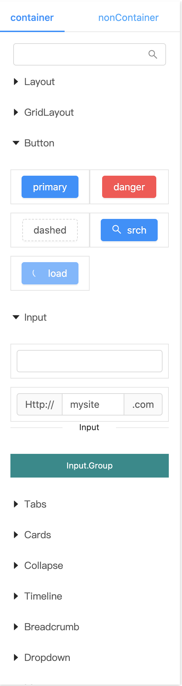
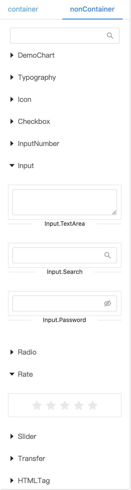

### 介绍
组件分类目的是为了让brick design知道这个组件是应该使用什么包装器包装组件，好让组件正常工作。
同时可以配置一些组件的默认属性，可以在组件预览区域展示组件的默认效果。

下为antd组件的分类配置信息。
```ts
import { CategoryType } from '@brickd/react'

export const reactContainers: CategoryType = {
	Layout: {
		components: {
			Layout: {
				props: [
					{
						style: {
							height: 100,
						},
					},
				],
			},
			'Layout.Header': {
				props: [
					{
						style: {
							height: 50,
						},
					},
				],
			},
			'Layout.Footer': {
				props: [
					{
						style: {
							height: 50,
						},
					},
				],
			},
			'Layout.Content': {
				props: [
					{
						style: {
							height: 100,
						},
					},
				],
			},
			'Layout.Sider': null,
		},
	},
	GridLayout: {
		components: {
			Row: null,
			Col: null,
		},
	},
	Button: {
		span: 12,
		props: [
			{
				type: 'primary',
				children: 'primary',
			},
			{
				type: 'danger',
				children: 'danger',
			},
			{
				type: 'dashed',
				children: 'dashed',
			},
			{
				type: 'primary',
				icon: 'search',
				children: 'srch',
			},
			{
				type: 'primary',
				loading: true,
				children: 'load',
			},
		],
	},
	...
}

export const reactNonContainers: CategoryType = {
	Typography: {
		components: {
			'Typography.Text': null,
			'Typography.Title': null,
			'Typography.Paragraph': null,
		},
	},

	InputNumber: {
		props: [{}],
	},
	Input: {
		components: {
			'Input.TextArea': {
				props: [{}],
			},
			'Input.Search': {
				props: [{}],
			},
			'Input.Password': {
				props: [{ visibilityToggle: true }],
			},
		},
	},
	...
}
```
预览区域展示





